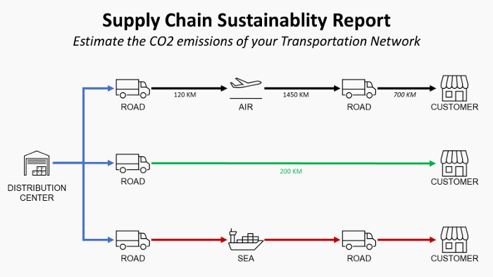

# Supply Chain Sustainability Reporting with Python 🌲
*4 steps to build an ESG reporting focusing CO2 emissions of your Distribution Network*

  

Supply Chain Sustainability Reporting

The demand for transparency in sustainable development from investors and customers has grown over the years.

Investors have placed an increased emphasis on sustainability of the business when assessing the value and resiliency of an organization.

Therefore, more and more organizations invest resources to build capabilities for sustainability reporting and determine the best strategies for a sustainable supply chain.

### Youtube Video
Click on the GIF below to access a short explainer video to understand the concept behind this solution

  

## **Article**
In this [Article](https://towardsdatascience.com/supply-chain-sustainability-reporting-with-python-161c1f63f267), we will introduce a simple methodology to **report the CO2 emissions of your Distribution Network** using **Python and PowerBI**.

## **Definition**
Based on the GHG Protocol corporate standard (Link), greenhouse gas emissions are classified into three scopes:

- Scope 1: direct emissions emissions released to the atmosphere because of the company’s activities (Company’s facilities like manufacturing plant/warehouses, company’s vehicles)
- Scope 2: indirect emissions from the generation of purchased energy
(purchased electricity, gas, ..)
- Scope 3: all indirect emissions (out of scope 2) occurring in the value chain of the company (Transportation, Waste of Operations, Business Travels, …)

In this article, we will focus on the Scope 3 calculations related to downstream transportation.
What is the environmental impact of your distribution network?

## **Formula**
Following the protocol the French Environmental Agency Ademe (Link), the formula to estimate the CO2 emissions of transportation is:

  

Formula using Emission Factor

## **Objective**

1. Based on this formula, we collect and process data to calculate the emissions.

  

Data to be Collected

2. We calculate the unit of measure conversions considering the shipped handling units.

  

Handling Units

3. We add distances by mode and compute the CO2 emissions by order 

  

Emission by transportation mode

## **Exemples of visuals using PowerBI**

### Bubble map with size = f(CO2 Total)

  

Bubble Map

_Visual Insights_

You can observe where you have the majority of CO2 emissions (large bubbles) with a color coding by transportation mode.

### Split by Country Destination and Item Code

  

Bar Chart

**Product Portfolio Insights**
For each market, which item has the highest environmental impact?

_Product Portfolio Insights_

For each market, which item has the highest environmental impact?

### CO2 = f(Turnover) by City Destination

  

Scatter Plot

_Financial Insights_

The impacts of your future efforts for CO2 Emission reductions on profitability will be higher for the customers in PEINE-WOLTORF.

# Code
This repository code you will find all the code used to explain the concepts presented in the article.

# About me 🤓
Senior Supply Chain Engineer with an international experience working on Logistics and Transportation operations. \
Have a look at my portfolio: [Data Science for Supply Chain Portfolio](https://samirsaci.com) \
Data Science for Warehousing📦, Transportation 🚚 and Demand Forecasting 📈 
